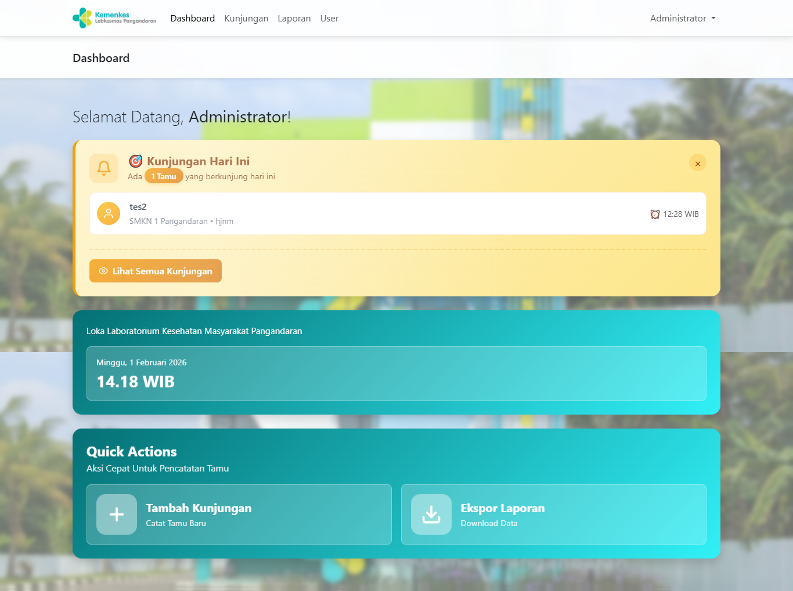

# Buku Tamu Digital

Buku Tamu Digital merupakan aplikasi berbasis web yang dibuat menggunakan framework Laravel untuk membantu proses pencatatan dan pengelolaan data pengunjung secara digital. Sistem ini dirancang untuk menggantikan pencatatan tamu secara manual sehingga proses pendataan menjadi lebih cepat, rapi, dan mudah dikelola.

## Fitur Aplikasi
- Form pengisian data tamu
- Dashboard admin
- Manajemen data kunjungan
- Feedback atau penilaian kepuasan tamu
- Laporan data kunjungan

## Teknologi yang Digunakan
- Laravel
- PHP
- MySQL
- Bootstrap

## Tujuan Sistem
Aplikasi ini dibuat untuk mempermudah proses pencatatan tamu yang sebelumnya dilakukan secara manual menggunakan buku. Dengan sistem digital, data kunjungan dapat disimpan dengan lebih aman, mudah dicari, dan dapat digunakan sebagai laporan secara cepat. Sistem buku tamu digital juga membantu meningkatkan efisiensi pengelolaan data pengunjung. :contentReference[oaicite:1]{index=1}

## Repository
Source code aplikasi tersedia di:
https://github.com/Bunga80/Buku-Tamu-Digital

## Tampilan Aplikasi

## Developer
Bunga Amelia, Desi Ayu Safitri, Seila, Silvia Oktaviani
